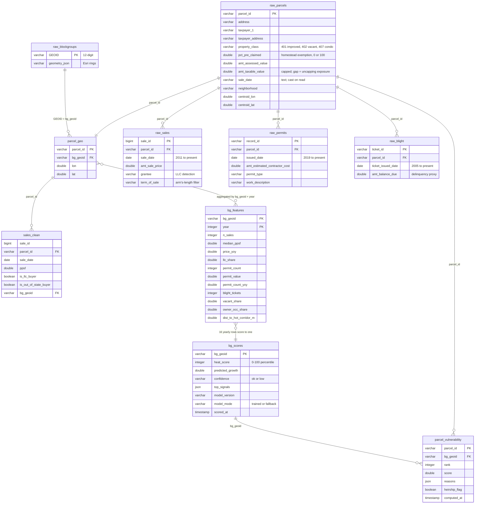

# Signals — Project Report

**Detroit anti-displacement early warning · 313 Buildathon**

Status as of 2026-09-18: all eight build steps are complete. The full demo path
runs end to end against real Detroit data on a single laptop.

| | |
|---|---|
| Records ingested | 1,868,219 across five city layers |
| Block groups scored | 625 (all of Detroit) |
| Forecast skill | Spearman ρ 0.39 on a held-out year |
| Backend tests | 64 passing |
| Local footprint | ~292 MB |

---

## 1. Planning and organization

### How the work was organized

The project runs on three documents plus a build order, deliberately separated so
that code work and human work never block each other.

| Document | Role |
|---|---|
| `README.md` | The public pitch and run instructions |
| `md/signal-details.md` | The working spec: problem, cut-line, demo script, risks |
| `md/architecture.md` | Source of truth: data sources, decisions, module contracts, data model, build order |
| `md/TODO.md` | Only the tasks a human must do — keys, local-knowledge decisions, long-running pulls |
| `CLAUDE.md` | Operating notes for the coding agent, including hard-won gotchas |

Two rules shaped everything else. First, an explicit **cut-line**: keep the block
heat score, the map, and the outreach brief; drop the land-value-tax simulator,
then the Census join, then per-household ranking, in that order. Nothing outside
the core path was built until the core path ran end to end. Second, **four
non-negotiable design constraints** carried from the spec's risk analysis into
the code:

1. Scoring stays deterministic and in code. Every score exposes its top
   contributing signals so an organizer can defend it out loud. Scoring logic
   never moves into a language-model call.
2. Household-level data is gated. Only block-level scores are public.
3. Heirship is a follow-up flag, never a determination, in both the data model
   and the interface copy.
4. If the sales history proves too thin to train on, fall back to a transparent
   weighted index and say so, rather than ship an unvalidated model.

### What was done

The build order ran in eight steps, each verified before the next began.

| Step | What shipped | Verification |
|---|---|---|
| 1 · Scaffold | Backend and frontend boot, health route live, gating enforced | 5 tests |
| 2 · Ingest | ArcGIS paginator with retry, incremental refresh, ID normalization | 15 tests + live pull of all five layers |
| 3 · Geo + features | Esri polygon parsing, parcel-to-block-group join, feature table | 32 tests, 377,892 of 377,940 parcels matched |
| 4 · Forecast | Gradient-boosted model, honest backtest, transparent fallback index | 40 tests, Spearman 0.39 |
| 5 · API + map | Block routes, choropleth, drawer — **demo milestone 1** | 46 tests, 625 block groups on the map |
| 6 · Vulnerability | Gated household ranking with a reason per term — **milestone 2** | 55 tests, 86–167 households per hot block group |
| 7 · Brief | Aggregate-only summary to OpenAI with a strict schema — **milestone 3** | 63 tests, real briefs generated |
| 8 · Polish | Corridor presets, failure banners, loading states, run instructions | 64 tests |

Four bugs found during the real-data runs are worth recording, because each one
changed a design decision rather than just a line of code.

**Offset pagination does not work on this data.** The sales layer degraded to
roughly 19 seconds per page at depth and intermittently returned a generic 400.
Switching to keyset pagination (`WHERE object_id > last ORDER BY object_id`) took
page times to well under a second regardless of depth, and the full 1.87-million-row
pull finished in 10 minutes with zero retries. The object-ID field name differs
per layer, so it is read from layer metadata at runtime.

**Junk dates stretched the feature grid.** Fifty-six blight tickets carry dates
between 2027 and 8535, and eight predate 2000. The first feature build expanded
the year grid to 6,525 years and four million rows. Aggregates are now bounded to
a sane year range, with a regression test.

**Price levels made the model rank mean reversion.** The first trained model's
strongest signal was "price level is low", so it ranked the cheapest block groups
in the city as the hottest, because a cheap thin market has the largest percentage
rebounds. Price-level features were removed from the model inputs, the training
window now requires at least five sales at both ends, and a confidence flag marks
block groups scored on fewer than three sales.

**The published fallback weights were wrong-signed.** Backtested across five
holdout years, the draft index weighted one-year price momentum positively and was
*anti*-predictive every single year. Momentum in a thin market reverts. The index
now discounts momentum and leads with investor share, and its per-year backtest is
written into the model report next to the model's own.

### What remains

Everything left is a human decision or a logistics item. None of it blocks the
code.

**Red — do now**

- **Confirm or replace the demo corridors.** The app ships three data-driven
  suggestions as fly-to buttons: Hubbard Richard, McDougall-Hunt, and University
  District as the control. Edit `DEMO_CORRIDORS` in `backend/signals/demo.py` and
  set `suggested: False` to make them yours.
- **Confirm the submission format**: live demo or video, time limit, whether
  judges want a repository link, and the deadline.
- **Assign ownership** if more than one person is building.

**Yellow — before the first full rehearsal**

- **Spot-check three parcels you personally know** against `raw_parcels`. This
  validates the owner-occupied rule, which is a heuristic, not a fact in the data.
- **Vet the protections list.** Five programs are configured today; Make It Home
  is not among them. The brief cannot recommend anything outside this list, and
  unlisted names are stripped even if the model produces one. Regenerate cached
  briefs after any change.
- **Find a real tax-delinquency source**, or approve the current proxy. No public
  layer carries delinquency, so unpaid blight balance stands in for it and is
  labelled a proxy in the interface.
- **Approve the anonymization rule** and decide whether the organization view
  should show taxpayer names at all. It currently does.
- **Decide trained model versus fallback index.** The recommendation is to ship
  the trained model and keep the fallback as a one-line switch.
- **Sanity-check the ten hottest block groups** against your own intuition.

**Green — before the demo**

- Decide the hot threshold for household ranking (default 70).
- Draft the three-minute script; the risks slide must state the gating policy out loud.
- Re-run the incremental ingest the morning of, then features, train, score.
- Pre-generate briefs for the demo block groups so the demo survives bad Wi-Fi.
- Read one generated brief end to end and flag anything that reads as a
  determination rather than a prompt for follow-up.

**Open architectural decision**

Deployment target. Vercel can host the frontend, but not the DuckDB backend: the
platform has no persistent filesystem, and the data is 292 MB. Two paths exist.
Either export the scored map, hot-block household lists, and cached briefs to
static JSON and deploy the frontend alone, or host the backend on a platform with
a persistent disk and point the Vercel frontend at it. This has not been decided.

---

## 2. Development

### Technologies and services

**Backend** — Python 3.12, managed with `uv`.

| Package | Role |
|---|---|
| `fastapi` + `uvicorn` | HTTP API |
| `duckdb` | Single-file analytical store, with the spatial extension |
| `pandas` + `pyarrow` | Feature engineering and Parquet caching |
| `geopandas` + `shapely` | Parcel-to-block-group point-in-polygon join, metric distance in UTM |
| `scikit-learn` | `HistGradientBoostingRegressor` and permutation importance |
| `httpx` | ArcGIS REST client |
| `pydantic-settings` | Typed settings from environment |
| `openai` | Outreach brief, structured output |
| `typer` | Command-line interface |
| `pytest` | Tests |
| `pytz` | Required by DuckDB to return timezone-aware timestamps |

**Frontend** — Vite 8, React 19, TypeScript 6.

| Package | Role |
|---|---|
| `react-leaflet` + `leaflet` | Choropleth map |
| `@tanstack/react-query` | Data fetching and cache |
| `oxlint` | Linting |

Plain CSS, no framework. Two screens did not justify one.

**External services.** Exactly two, and only one of them needs a key.

| Service | Key needed | Used for |
|---|---|---|
| Detroit Open Data Portal (ArcGIS REST) | No | All five data layers |
| Esri World Light Gray Base tiles | No | Basemap |
| OpenAI (`gpt-5-mini`) | Yes | Outreach brief only |

Everything except the brief runs offline from the local database. The basemap is
Esri rather than CARTO because CARTO now watermarks keyless tiles with "API KEY
REQUIRED", which was discovered by looking at the running map.

**Configuration.** Four environment values in `backend/.env`, one in
`frontend/.env.local`.

| Variable | Purpose |
|---|---|
| `OPENAI_API_KEY` | Brief generation. Everything else works without it. |
| `OPENAI_MODEL` | Defaults to `gpt-5-mini`. |
| `SIGNALS_ORG_TOKEN` | Shared secret standing in for organization accounts. |
| `SIGNALS_DEMO` | When true, household output is anonymized. |
| `MODEL_MODE` | `auto`, `trained`, or `fallback`. The escape hatch. |
| `VITE_ORG_TOKEN` (frontend) | Must match `SIGNALS_ORG_TOKEN`. |

### Pipeline

The backend is a linear chain. Each stage consumes the previous stage's output
and persists its own, so any stage can be re-run without repeating the one before.

```
Detroit ArcGIS  ──▶  ingest.py   ──▶  data/raw/*.parquet  ──▶  raw_* tables
                                                                    │
                     geo.py      ◀───────────────────────────────────┘
                        │  parcel centroid → block-group polygon
                        ▼
                     parcel_geo
                        │
                     features.py ──▶  sales_clean, bg_features
                        │
                     forecast.py ──▶  bg_scores + backtest_report.json
                        │
        ┌───────────────┴────────────────┐
        ▼                                ▼
  vulnerability.py                    brief.py ──▶ OpenAI ──▶ data/briefs/*.json
  (gated, live)                       (aggregate summary only)
        │                                │
        └──────────▶  api.py  ◀──────────┘
                        │
                     frontend (map + drawer)
```

### Machine learning method

One supervised model does the forecasting; nothing else in the pipeline is
learned. `forecast.py` trains and scores it; `vulnerability.py`'s household
ranking is hand-fitted rules, and the OpenAI call in `brief.py` only writes
prose from numbers the model already produced (constraint 1, above).

**Framing.** Block-group-year is the unit of prediction. The target is the
two-year forward change in sale price per square foot, in log space:

```
target = log(median_ppsf[block group, year T+2]) - log(median_ppsf[block group, year T])
```

Log-differencing turns the target into a growth rate, so a $30/sqft block
group and a $90/sqft block group are on the same scale. Rows are dropped
where either end has fewer than 5 arm's-length sales or a starting
`median_ppsf` under $20 — under those floors the ratio is sale-mix noise, not
market movement (`MIN_SALES_FOR_TARGET`, `MIN_PPSF_FOR_TARGET` in
`forecast.py`).

**Algorithm.** `sklearn.ensemble.HistGradientBoostingRegressor` — histogram-based
gradient-boosted trees, scikit-learn's default choice for tabular data at this
size. It needs no feature scaling, handles the nonlinear thresholds this data
has (a corridor is close or it isn't; a block flips from majority-owner to
majority-LLC sales), and trains in seconds on ~2,600 rows, which ruled out
anything that wants a larger sample or a GPU.

**Features fed to the model** — nine columns, all derived from the current or
prior year, never from the target year:

| Feature | What it captures |
|---|---|
| `n_sales` | Sale volume that year (also gates confidence) |
| `price_yoy` | One-year change in median $/sqft |
| `llc_share` | Share of sales bought by an LLC or corporate entity |
| `permit_count` | Building permits issued |
| `permit_value` | Dollar value of those permits |
| `new_construction_permits` | New-construction permits specifically |
| `permit_count_yoy` | One-year change in permit count |
| `blight_tickets` | Blight violation tickets issued |
| `dist_to_hot_corridor_m` | Metric distance to the nearest flagged commercial corridor |

**Features deliberately excluded**, both explained in the `forecast.py`
docstring so they aren't reintroduced by accident:

- `vacant_share`, `owner_occ_share`, `out_of_state_share` — these describe the
  parcel file *today*. Feeding a present-day snapshot to a model trained on
  past windows would leak the future into the backtest. They stay in
  `bg_features` for `vulnerability.py`, which is allowed to look at today.
- `median_ppsf`, `median_price` — price *levels*. The first real-data run
  included them, and the model's top signal became "low price level": it
  ranked $8–22/sqft block groups with a falling prior year as the hottest in
  the city, because a cheap, thin market has the largest percentage rebounds.
  That's mean reversion, not investment pressure. Dropping levels forces the
  model to rank on momentum, LLC buying, permits, blight, and corridor
  distance — the signals the product actually claims to measure.

**Training / evaluation split.** Time-based, not random, so the backtest
can't see the future: trained on rows built from years 2011–2022, held out
2023. From the real run (2026-09-18):

| | |
|---|---|
| Training rows | 2,626 |
| Holdout rows | 425 |
| Holdout Spearman ρ | 0.386 |
| Holdout R² | 0.105 |
| Holdout MAE | 0.215 (vs. 0.229 for predict-the-mean) |

Spearman is the headline metric because the product only needs a *ranking* of
block groups, not a precise growth number. 0.39 is real but modest skill —
stated as such everywhere it's surfaced (health route, drawer footnote, demo
script), never rounded up.

**From prediction to heat score.** The raw model output is a predicted log
growth rate per block group. The heat score shown on the map is that
prediction's percentile rank across all 625 block groups that year, 0–100 —
a relative measure ("hotter than X% of Detroit"), not an absolute forecast.

**Explainability.** `permutation_importance` runs once at train time against
the holdout set and ranks the nine features by how much shuffling each one
degrades the model's score. For every scored block group, the top three
features are picked by that global ranking, then each is converted to a
z-score against the city that year and given a plain-language label
(`SIGNAL_LABELS`) and an up/down direction. That's what the drawer and the
brief show as "top signals" — they come from the model's own importances, not
from prose written by a language model.

**Fallback path.** Per constraint 4, if training data were too thin (fewer
than `MIN_TRAINING_ROWS = 500` rows, or holdout Spearman below
`MIN_BACKTEST_SPEARMAN = 0.2`), `forecast.py` ships a deterministic weighted
index instead of an unvalidated model:

| Feature | Weight |
|---|---:|
| `llc_share` | +0.35 |
| `price_yoy` | −0.25 |
| `permit_count_yoy` | +0.15 |
| `permit_value` | +0.10 |
| `dist_to_hot_corridor_m` | −0.15 |

These weights are backtested too (Spearman 0.13–0.32 across 2019–2023,
recorded in `backtest_report.json`), not asserted. An earlier draft weighted
one-year price momentum positively and was *anti*-predictive on every one of
those five years — in a thin market, last year's price spike is mostly
sale-mix noise and reverts, so momentum is now a negative weight. On the real
2026-09-18 run the trained model cleared both thresholds
(`auto_mode_decision: "trained"`), so all 625 `bg_scores` rows are
`model_mode = "trained"`; `MODEL_MODE=fallback` in `.env` forces the index
path for testing or demo purposes without retraining.

**Reproducing it.** `uv run signals train` retrains from `bg_features`,
rewrites `data/models/model.joblib` and `backtest_report.json`, and scores all
625 block groups. `uv run signals score` re-scores from the saved model
without retraining.

### Database

DuckDB, one file at `backend/data/signals.duckdb`. Raw pulls are also cached as
Parquet so a re-run never re-hits the city's servers.

**Live row counts**

| Table | Rows | Notes |
|---|---:|---|
| `raw_parcels` | 377,940 | Current parcel file, with centroids |
| `raw_sales` | 537,595 | Sales history, 2011 to present |
| `raw_permits` | 47,154 | Building permits, 2019 to present |
| `raw_blight` | 904,905 | Blight tickets, 2005 to present |
| `raw_blockgroups` | 625 | 2020 census block groups, polygons |
| `parcel_geo` | 377,940 | 377,892 matched; 48 fall outside every polygon |
| `sales_clean` | 110,097 | Arm's-length only; 40% LLC buyers, 12% out-of-state |
| `bg_features` | 10,000 | 625 block groups × 16 years, 2011–2026 |
| `bg_scores` | 625 | One row per block group |
| `parcel_vulnerability` | 0 | Computed live by default; `signals rank` fills it |

**Disk**

| Path | Size |
|---|---:|
| `data/raw/` (Parquet) | 116 MB |
| `data/signals.duckdb` | 176 MB |
| `data/models/` | 264 KB |
| `data/briefs/` | 28 KB |
| Total | ~292 MB |

All of it is local and gitignored. Nothing is uploaded anywhere.

### Entity-relationship diagram



Three things about this model are worth saying out loud.

`parcel_id` is the join key across every city layer, and in every layer it carries
a trailing period (`21013863.`). It is normalized once, at ingest.

Parcels carry a census **tract** identifier but not a block group, so the
block-group assignment is computed locally by point-in-polygon against the 2020
block-group polygons. That is what `parcel_geo` is.

Briefs are **not** a database table. They are JSON files under `data/briefs/`,
keyed by block group, model version, and language model. The API holds a read-only
database connection, and a file cache also survives a re-ingest.

### API

Six routes. Four are public and block-level only; two are gated behind the
`X-Org-Token` header and are the only way to reach household data.

| Method | Route | Access |
|---|---|---|
| GET | `/api/health` | public |
| GET | `/api/demo/corridors` | public |
| GET | `/api/blocks` | public |
| GET | `/api/blocks/{geoid}` | public |
| GET | `/api/blocks/{geoid}/households` | **gated** |
| POST | `/api/blocks/{geoid}/brief` | **gated** |

Every response below is real output captured from the running service.

#### `GET /api/health`

Says whether data exists, when it was scored, and which model produced it.

```bash
curl -s http://127.0.0.1:8000/api/health
```

```json
{
  "ok": true,
  "configured_model_mode": "auto",
  "scored_model_mode": "trained",
  "scored_at": "2026-09-18T12:14:29.010619-04:00",
  "n_scored": 625,
  "geo_level": "block_group",
  "demo": true,
  "time": "2026-09-18T17:31:22.233592+00:00"
}
```

#### `GET /api/blocks`

The map payload: a GeoJSON FeatureCollection of all 625 block groups joined to
their scores. Roughly 575 KB, about 40 ms cold and 10 ms cached. The cache key is
the scoring timestamp, so a re-score invalidates it automatically.

```bash
curl -s http://127.0.0.1:8000/api/blocks
```

```json
{
  "type": "FeatureCollection",
  "features": [
    {
      "type": "Feature",
      "properties": {
        "bg_geoid": "261635211002",
        "neighborhood": "Hubbard Richard",
        "heat_score": 100,
        "confidence": "ok",
        "model_mode": "trained",
        "top_signals": [
          {
            "feature": "price_yoy",
            "value": -0.8085954031080416,
            "z": -2.365,
            "direction": "down",
            "weight": 0.0319,
            "label": "sale prices vs. the year before (one-year swings mostly revert in thin markets)"
          },
          {
            "feature": "llc_share",
            "value": 0.75,
            "z": 1.568,
            "direction": "up",
            "weight": 0.0051,
            "label": "share of sales bought by LLCs / investors"
          },
          {
            "feature": "dist_to_hot_corridor_m",
            "value": 1101.4677238641111,
            "z": -0.911,
            "direction": "down",
            "weight": 0.0038,
            "label": "distance to the nearest high-permit corridor"
          }
        ]
      },
      "geometry": { "type": "Polygon", "coordinates": [[ "..." ]] }
    }
  ]
}
```

Note what is absent: no parcel identifiers, no names, no addresses. A public
response cannot leak household data because household data never enters it.

#### `GET /api/blocks/{geoid}`

One block group in full: the score, the labelled signals, a per-year trend series
with the partial current year flagged, and the model footnote the drawer prints.

```bash
curl -s http://127.0.0.1:8000/api/blocks/261635211002
```

```json
{
  "bg_geoid": "261635211002",
  "neighborhood": "Hubbard Richard",
  "heat_score": 100,
  "predicted_growth": 0.6028674066715474,
  "confidence": "ok",
  "model_version": "hgb-v1",
  "model_mode": "trained",
  "scored_at": "2026-09-18T12:14:29.010619-04:00",
  "top_signals": [ "... as above ..." ],
  "trend": {
    "years": [2023, 2024, 2025, 2026],
    "partial_year": 2026,
    "series": {
      "n_sales":        [3.0, 9.0, 4.0, 1.0],
      "median_ppsf":    [83.1, 224.6, 100.1, 142.0],
      "median_price":   [100000.0, 235000.0, 133750.0, 215000.0],
      "llc_share":      [0.0, 0.2, 0.8, 0.0],
      "permit_count":   [5.0, 8.0, 10.0, 9.0],
      "permit_value":   [2271813.0, 57935.0, 3658840.0, 2049004.0],
      "blight_tickets": [55.0, 41.0, 15.0, 17.0]
    }
  },
  "backtest_summary": "model hgb-v1 · backtest on 2023: Spearman ρ = 0.39, R² = 0.11"
}
```

The full response carries all 16 years; it is trimmed here. An unknown block
group returns 404:

```json
{ "detail": "unknown block group 999999999999" }
```

#### `GET /api/blocks/{geoid}/households` — gated

Owner-occupied households on a hot block group, ranked by exposure, each with the
reasons behind its score. Computed live in 40–70 ms. Without the header:

```bash
curl -s http://127.0.0.1:8000/api/blocks/261635211002/households
# 403
{ "detail": "invalid or missing X-Org-Token" }
```

With it, in demo mode:

```bash
curl -s -H "X-Org-Token: $SIGNALS_ORG_TOKEN" \
  http://127.0.0.1:8000/api/blocks/261635211002/households
```

```json
{
  "bg_geoid": "261635211002",
  "hot": true,
  "hot_threshold": 70,
  "anonymized": true,
  "heirship_note": "Possible heirs' property: follow up, not a determination",
  "households": [
    {
      "rank": 1,
      "score": 9.793,
      "address": "1500 block of 17TH ST",
      "reasons": [
        "No Principal Residence Exemption on file (mailing address matches the home)",
        "Unpaid blight ticket balance $465 (delinquency proxy)",
        "No sale on record — likely long tenure",
        "Taxable value 90% below assessed — a transfer would spike the tax bill"
      ],
      "heirship_flag": false,
      "has_pre": false,
      "tenure_years": null,
      "unpaid_blight_balance": 465.0,
      "uncapping_gap": 0.896
    }
  ]
}
```

In demo mode `parcel_id` and `owner` are absent and the address is reduced to its
hundred-block. Outside demo mode both fields are present and the address is exact.
A block group below the threshold returns `"hot": false` with an empty list rather
than an error.

#### `POST /api/blocks/{geoid}/brief` — gated

Generates, or returns the cached, one-page outreach brief. Add `?force=true` to
regenerate.

```bash
curl -s -X POST -H "X-Org-Token: $SIGNALS_ORG_TOKEN" \
  http://127.0.0.1:8000/api/blocks/261635211002/brief
```

```json
{
  "bg_geoid": "261635211002",
  "neighborhood": "Hubbard Richard",
  "cached": true,
  "llm_model": "gpt-5-mini",
  "brief": {
    "headline": "Hubbard Richard block group flagged: high investment pressure (heat score 100)",
    "what_is_changing": [
      "Last year's recorded sale prices were lower than is typical for Detroit. In a block group with few sales this often reflects a thin-market swing that can reverse.",
      "Investors are buying a larger share of homes here than is typical for the city."
    ],
    "why_it_matters": "This area shows signs investors are active and sale activity is thin. That combination can lead to quick turnover of properties and pressure on long-time owners. There are 167 owner-occupied homes in the block group and 44 households flagged as missing a Principal Residence Exemption (PRE) filing. The model flagged 3 households as possible heirs' property cases (see caveats).",
    "protections_to_offer": [
      {
        "name": "Principal Residence Exemption (PRE)",
        "who_qualifies": "Owner-occupants who have not filed a PRE affidavit with the Assessor.",
        "first_step": "At the door, ask: Do you live here as your primary residence and have you filed a PRE affidavit with the Assessor? If not, offer to start the PRE affidavit now..."
      }
    ],
    "canvassing_plan": [
      "Start on the blocks with visible signs of long-term occupancy and owner care...",
      "Bring PRE affidavit paper forms or a device to start the online PRE filing, a pen, and photo ID guidance."
    ],
    "caveats": [
      "The heirs' property flag is a name-based follow-up signal, not a determination."
    ]
  }
}
```

Failure modes are explicit rather than a generic 500: a missing API key returns
503 with that message, a provider failure returns 502 with the provider's own
message, and an unknown block group returns 404.

**What the language model is allowed to see.** Only an aggregate summary: the
score, the labelled signals, five complete years of trend, and *counts* of
household reason types. It never receives a household row, a name, or an address.
It cannot recommend a protection outside the vetted list, and any name it invents
anyway is stripped after parsing. Output is constrained by a strict JSON schema
derived from the response model.

### Starting the app

Prerequisites: `uv` with Python 3.12, Node 20 or newer, and an OpenAI key for the
brief only.

```bash
# 1 · secrets, never committed
cp backend/.env.example backend/.env       # set OPENAI_API_KEY and SIGNALS_ORG_TOKEN
echo "VITE_ORG_TOKEN=<same token>" > frontend/.env.local

# 2 · pipeline — about 10 minutes once, then seconds
cd backend
uv sync
uv run signals ingest      # five ArcGIS layers → Parquet + DuckDB (~292 MB, local)
uv run signals features    # spatial join, block-group × year features, map polygons
uv run signals train       # backtest, refit, score all 625 block groups

# 3 · run
uv run signals serve                           # API on http://127.0.0.1:8000
cd ../frontend && npm install && npm run dev    # map on http://localhost:5173
```

Other commands:

| Command | Purpose |
|---|---|
| `signals ingest --resume` | Continue an interrupted pull, skipping saved layers |
| `signals ingest --since <date>` | Incremental refresh of sales, permits, blight |
| `signals score` | Re-score from the saved model without retraining |
| `signals rank` | Precompute `parcel_vulnerability` for inspection |
| `signals brief <geoid…>` | Pre-generate and cache briefs for an offline demo |
| `uv run pytest` | Run the backend test suite |
| `npm run build` | Type-check and produce the production bundle |

**Two operational gotchas**, both learned the hard way:

The API process is named `signals serve`. A stale server on port 8000 will keep
answering with old code and give no sign that the new one failed to bind. Stop it
with `pkill -f "signals serve"`.

DuckDB cannot serve reads while another process holds the database file for
writing, so stop the API before running pipeline commands.

---

## 3. Test plan

### Strategy

Every test runs against synthetic fixtures — a mocked HTTP transport for the
paginator, tiny in-memory DuckDB databases for everything else, and a fake client
for the language model. The suite needs no network, no API key, and no ingested
data, and finishes in about three seconds. That was deliberate: a test suite that
depends on a 10-minute pull is a test suite nobody runs.

Synthetic fixtures alone are not sufficient, though, and the record shows why.
Four of the bugs listed in section 1 were invisible to unit tests and only
appeared against real data. So the plan has two layers: unit tests to hold
behaviour still, and a live verification pass at each build step whose findings
are then frozen into new unit tests. Every real-data bug in this project gained a
regression test on the way out.

### Coverage by module

**64 tests, all passing.**

| File | Tests | What it covers |
|---|---:|---|
| `test_ingest.py` | 15 | Keyset pagination termination, `--since` combined with the keyset clause, object-ID discovery from layer metadata, centroid and geometry extraction, empty-result schema stability, retry-then-succeed, give-up-after-max-retries, date coercion from epoch milliseconds and ISO strings, parcel ID normalization, incremental window replacement, `--resume` skipping saved layers |
| `test_api.py` | 12 | Score and name joins in the map payload, cache keyed on scoring time, trend and footnote in the detail route, 404 on unknown block group, health reporting, the token gate at 403, demo anonymization on the wire, full detail outside demo mode, `hot: false` below threshold, brief cache flag, missing-key surfaced as 503, corridor presets enriched with live scores |
| `test_forecast.py` | 8 | Partial-year exclusion, target arithmetic and window bounds, planted-signal recovery with artifacts written, score shape and top signals, fallback determinism and weight signs, the auto-mode thresholds, database round-trip, low-confidence flagging |
| `test_features.py` | 6 | Year-over-year math with and without the thin-year gate, no bleed across block groups, corridor-distance ordering, the arm's-length and price-floor filters end to end, junk far-future dates excluded from the year grid, pre-2019 permits held as null rather than zero |
| `test_geo.py` | 6 | Esri ring winding detection, polygons with holes, multipart polygons, malformed orphan-hole rejection, point-in-polygon assignment, GeoJSON export and caching |
| `test_vulnerability.py` | 6 | Address matching that ignores street suffix, entity and surname helpers, scoring and ordering with each reason string, cold block groups returning empty, persistence idempotence, anonymization stripping identity |
| `test_brief.py` | 6 | Summary is aggregate-only and no household row leaks into it, unknown block group, strict schema and prompt rules including vetted eligibility text, unlisted protections dropped, file cache hit and forced regeneration, missing key raising a clear error |
| `test_scaffold.py` | 5 | Application boots, health route, settings load, gating wiring |

Four tests deserve individual mention because they encode a policy rather than a
behaviour. `test_summary_is_aggregate_only_and_counts_reasons` serializes the
language-model payload and asserts that no address or name appears anywhere in it.
`test_unlisted_protection_is_dropped` proves an invented program name cannot
survive to the user. `test_anonymize_strips_identity_and_reduces_address` pins the
demo rule. `test_gated_routes_require_token` proves 403 without the header. These
are the four non-negotiables from the spec, expressed as failing builds.

### Verification beyond unit tests

| Check | Result |
|---|---|
| Live pull of all five layers | Row counts match the city's own totals exactly |
| Backtest on a held-out year | Spearman 0.39 on 2023, 0.31 on 2022 |
| Fallback index across five holdout years | +0.13 to +0.32, all positive |
| Map render against real data | 625 block groups, hot list matches Detroit intuition |
| Household route on real block groups | 86–167 households in 40–70 ms |
| Brief generation, real API | ~40 s uncached, instant cached, output reviewed by hand |
| Frontend type-check and production build | Clean |

### Known gaps

Honest list, since judges may ask.

- **No frontend unit tests.** The frontend is verified by type-checking, a
  production build, and looking at it. Two screens on a weekend budget.
- **No end-to-end browser automation.** The click path was walked manually.
- **The owner-occupied rule is unvalidated against ground truth.** It is a
  heuristic over exemption status and address matching. Item C.2 on the human
  list is exactly this check, and it is not yet done.
- **No load testing.** The read path is a single local file; concurrency beyond a
  demo has not been examined.
- **Model skill is modest and stated as such.** Spearman 0.39 is real ranking
  skill, not a precise predictor, and the interface prints the number rather than
  hiding it.

---

## 4. Demo

### Before you start

Run these the morning of, in this order:

```bash
cd backend
uv run signals ingest --since 2026-08-01   # fresh permits and sales
uv run signals features && uv run signals train
uv run signals brief 261635211002 261635190002 261635384002   # or your own picks
uv run signals serve
# second terminal
cd frontend && npm run dev
```

The brief step matters. It is the only part of the product that needs the
internet, and pre-generating caches the result to disk, so the demo works on a
dead venue connection. Confirm `SIGNALS_DEMO=1` is set before showing households
to a room.

### The three-minute walk

**Open the map.** Detroit, 625 block groups, a single-hue red ramp. Dark red is
high investment pressure. The header states how many block groups are scored and
which model produced the number. Name the unit out loud once: census block group,
roughly 300 to 600 parcels, about the size of a few streets.

**Press the control preset first.** University District comes back in the single
digits. This is the honest move. A map where everything is on fire proves nothing;
showing the cool case first makes the hot case mean something.

**Press corridor 1.** Hubbard Richard, on the Corktown and Mexicantown edge, heat
100. The drawer opens with the score and, immediately under it, *why*: investors
bought a larger share of homes here than is typical, the block group sits closer
to a high-permit corridor than most of the city, and last year's thin-market price
swing is the kind that reverts. These sentences come from the model's own
permutation importances, not from prose written by a language model.

**Say the honest thing about the top signal.** The strongest single predictor is a
*dip* in last year's price. In a block group with five to ten sales a year, one
spike reverts, so "prices fell last year" reads as pressure arriving, not as
decline. Judges who know statistics will respect that you said it before they
asked. The footnote at the bottom of the drawer prints the backtest: Spearman 0.39
on a held-out year.

**Scroll to the households.** 167 owner-occupied homes ranked by exposure. Each
row carries its own reasons: no homestead exemption on file, an unpaid blight
balance, no sale on record so likely long tenure, taxable value 90 percent below
assessed so a transfer would spike the tax bill. Addresses read "1500 block of
17TH ST". No names, no parcel identifiers. Say why: this list is the reason the
product is gated, and the demo is anonymized on purpose.

**Press "Generate outreach brief."** It returns instantly from cache. One page: what
is changing, why it matters here, which protections to offer with who qualifies and
a first step a canvasser can take at the door, a plan for which blocks to knock
first, and caveats. Point at the protections: the model may only recommend from a
vetted list, and anything else it names is stripped before display.

**Close.** *"Detroit is growing. This decides whether the people who stayed get to stay."*

### Where the data comes from

Five layers, all from the City of Detroit's own Open Data Portal, all public, no
key required. Endpoints were verified live rather than taken from documentation.

| Layer | Service | Rows | Coverage |
|---|---|---:|---|
| Parcels | `parcel_file_current` | 377,940 | Current snapshot |
| Property sales | `assessor_property_sales_view` | 537,595 | 2011 → present |
| Building permits | `bseed_building_permits` | 47,154 | 2019 → present |
| Blight tickets | `blight_tickets` | 904,905 | 2005 → present |
| Census block groups | `CensusBlockgroup2020` | 625 | 2020 boundaries |

All under `https://services2.arcgis.com/qvkbeam7Wirps6zC/ArcGIS/rest/services/`.
Each is published by the department that owns it: the Assessor for parcels and
sales, BSEED for permits, the Department of Appeals and Hearings for blight.

Two provenance notes. The 625 block groups confirm the scope is Detroit proper,
not the county: Wayne County has roughly 1,200 and Michigan roughly 8,200. And
there is one decoy to avoid, recorded in the source definitions: a
`Building_Permits` layer on a different ArcGIS host that looks right in search
results but is a quarterly aggregate with no parcel identifier and no per-record
dates.

**Not in the data.** Tax delinquency and foreclosure status are Wayne County
Treasurer records and appear in none of these layers. Unpaid blight balance stands
in for them and is labelled "delinquency proxy" everywhere it appears, including
in the brief. Finding a real source is an open item.

### Questions to expect

**"Is this a list of people to target?"** It is the opposite, and the architecture
enforces it. Household data is never public: block-level scores are open, and
household rows require an organization token. The demo view drops names and parcel
identifiers and reduces addresses to the hundred-block. The output is a canvassing
plan for offering tax exemptions and probate help, not a lead list.

**"How accurate is the forecast?"** Spearman 0.39 on a held-out year, 0.31 on the
year before. That is real ranking skill and a modest one. Mean absolute error is
0.215 against 0.229 for guessing the average, so it beats the naive baseline but
not dramatically. The number is printed in the interface rather than buried. What
the product claims is a ranking of where to look first, not a price prediction.

**"What if the model is wrong or overfit?"** Three answers. The backtest is
honest: train on everything before a year, evaluate on that year, never on data
the model saw. A transparent weighted index is shipped alongside, its weights are
published, and a single configuration value switches to it. And the whole thing is
inspectable — every score exposes its top three contributing signals, so an
organizer can defend or dispute a number without trusting the model.

**"Why did the hottest block group have prices *falling*?"** Because in a thin
market a one-year swing reverts. Block groups here see five to ten arm's-length
sales a year, so a single unusual sale moves the median. Backtested alone, one-year
momentum correlates *negatively* with realized two-year growth, from −0.35 to −0.40.
The model learned that; the interface says it in plain words.

**"What does the AI actually do?"** It writes the outreach brief and nothing else.
Scoring is deterministic and in code, by design and by constraint. The model sees
an aggregate summary — the score, the labelled signals, five years of trend, and
counts of household reason types — and never a household row, a name, or an
address. It may only recommend from a vetted list of programs, and names outside
that list are stripped after parsing.

**"How do you know a house is owner-occupied?"** Two signals: a claimed homestead
exemption, or the taxpayer mailing address matching the property address by house
number and street, with corporate entities excluded. It is a heuristic and is
labelled as one. Validating it against known parcels is an open item.

**"Isn't flagging heirs' property risky?"** Yes, which is why it is a flag and
never a determination. It comes from name heuristics: estate or heirs wording in
the taxpayer name, or a surname that differs from the last recorded buyer after
fifteen years. Every place it appears, the interface and the brief say "possible
heirs' property: follow up, not a determination", along with the cue that
triggered it.

**"Where does the data live? Is it private?"** Entirely on one laptop. 292 MB of
Parquet and DuckDB under `backend/data/`, gitignored, never uploaded. The only
outbound network call in the entire product is the brief, which sends aggregate
counts and no personal data.

**"Can it scale to another city?"** The pipeline is generic; the endpoint
definitions are not. Any city publishing parcels, sales, permits, and block-group
polygons through ArcGIS REST would need new layer definitions and a re-check of
field names, but the feature engineering, model, and ranking carry over.

**"Why block groups and not blocks?"** A true census block averages 10 to 30
parcels, too few for a stable annual price median. Block groups run 300 to 600
parcels, which produces a real signal and still reads as a few streets on a
corridor-scale map. The unit sits behind one configuration value and can be
changed.

**"What's not done?"** The census income join and the land-value-tax simulator
were both below the cut-line and were not built. There are no frontend tests. The
owner-occupancy rule is unvalidated against ground truth. And the deployment
target is undecided, because the backend needs a persistent disk that Vercel does
not provide.

---

## Appendix — one-line summary of each module

| Module | Responsibility |
|---|---|
| `config.py` | Typed settings, the vetted protections list, geography and model-mode switches |
| `db.py` | DuckDB connection and derived-table schema |
| `sources.py` | The five ArcGIS layer definitions, field lists, and the decoy warning |
| `ingest.py` | Keyset paginator with retry, Parquet cache, incremental refresh |
| `geo.py` | Esri ring parsing, parcel-to-block-group join, GeoJSON export |
| `features.py` | Arm's-length sales filter, block-group × year aggregation, year-over-year deltas, corridor distance |
| `forecast.py` | Train, backtest, refit, score; the transparent fallback index; signal labels |
| `vulnerability.py` | Owner-occupied ranking with a reason string per term |
| `demo.py` | Corridor presets and household anonymization |
| `brief.py` | Aggregate summary, structured-output call, protection enforcement, file cache |
| `store.py` | Read-side queries for the API |
| `api.py` | Six routes, the token gate, the map-payload cache |
| `cli.py` | `ingest`, `features`, `train`, `score`, `rank`, `brief`, `serve` |
